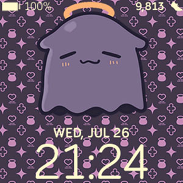

# Hololive Watch

An animated watch face that is inspired by Hololive.

Currently, only the takodachi is available. Perhaps in future, there will be others.

Image Credits:

- Background credits 1: <https://www.reddit.com/r/Hololive/comments/nfnyes/i_made_a_vector_file_for_inas_background_symbols/>
- Background credits 2: <https://www.artstation.com/artwork/b5qWyn>
- Takodachi credits: <https://tenor.com/view/takodachi-ina-ninomae-ninomae-inanis-hololive-gif-20761271>

Based on Source:

- <https://github.com/ibizabroker/minimalistic-digital>

## Displays

- Battery
- Date and Time
- Stats on rotation (Heart Rate, Steps, Calories, Distance)

## Screenshots



## Development

```shell
npm install
```

## Build

```shell
npx fitbit
fitbit$ bi
```
